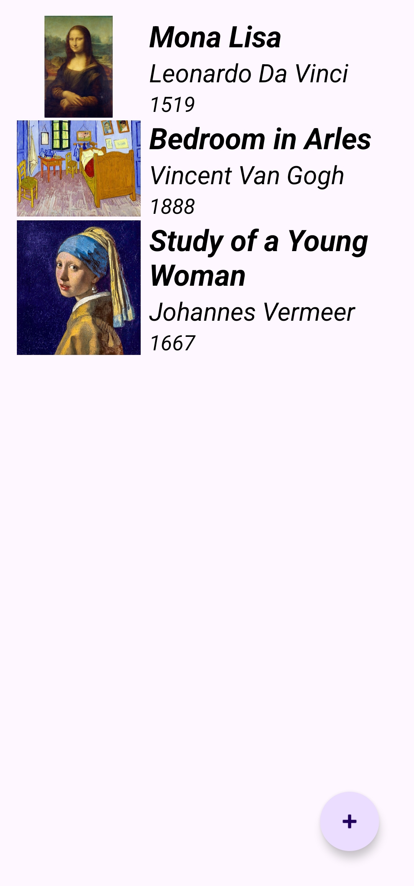
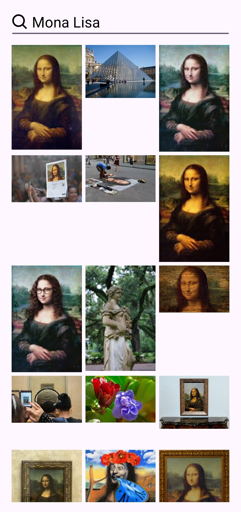

# Art Book 2 (Android • Kotlin • Hilt)

An Android app to collect and manage artworks with image search, built using Kotlin, MVVM, Hilt, Room, Retrofit, Glide, and Navigation Component. Search artwork images via the Pixabay API, save entries locally, and manage them with swipe-to-delete.

## Features
- Add artworks with name, artist, year, and selected image
- Image search with debounced queries (Pixabay API)
- Persist data locally using Room
- Swipe-to-delete in the list
- Shared `MainViewModel` across fragments
- ViewBinding for type-safe views
- Dependency Injection with Hilt
- Navigation Component with Safe Args

## Tech Stack
- Kotlin, Coroutines
- Architecture: MVVM
- DI: Hilt
- Network: Retrofit + Gson
- Image Loading: Glide
- Persistence: Room
- Navigation: AndroidX Navigation Component (Safe Args)
- UI: Material Components, RecyclerView, ViewBinding
- Testing: JUnit4, Truth, Mockito, AndroidX Test

## App Info
- Application ID: `com.receparslan.artbook`
- Min SDK: 26
- Target/Compile SDK: 36
- Kotlin Gradle plugin: `2.2.21`
- Java/Kotlin target: `11`

## Screenshots
| List Screen                                                | Search Screen                                                  | Add Screen                                               |
|------------------------------------------------------------|----------------------------------------------------------------|----------------------------------------------------------|
|  |  |  |

## Module Structure
```
app/
  src/main/java/com/receparslan/artbook/
    adapter/              # RecyclerView adapters
    apiService/           # Retrofit service (Pixabay)
    database/             # Room DB & DAO
    hilt/                 # Hilt modules & Application
    model/                # Entities & API models
    repository/           # Repository & interface
    util/                 # Constants, Resource, extensions
    view/                 # Fragments & FragmentFactory
    viewmodel/            # MainViewModel (Hilt)
```

## Key Files
- `util/Constant.kt`: `BASE_URL` for Pixabay
- `app/build.gradle.kts`: injects `BuildConfig.API_KEY` from `local.properties` (debug build)
- `apiService/ArtApiService.kt`: Retrofit endpoint for image search
- `repository/ArtRepository.kt`: Merges local DB and remote search
- `database/ArtDatabase.kt`, `database/ArtDao.kt`: Room setup
- `view/MainFragment.kt`: List + swipe-to-delete
- `view/DetailFragment.kt`: Create art and pick image
- `view/SearchFragment.kt`: Debounced search + grid results

## Getting Started
### Prerequisites
- Android Studio (Ladybug or newer)
- Android SDK 36; JDK 11

### Open and Run (Android Studio)
1. File > Open > select this project root
2. Let Gradle sync finish
3. Run the `app` configuration on a device/emulator (API 26+)

### Build from Terminal (Windows PowerShell)
```pwsh
# In project root
.\gradlew.bat clean assembleDebug
```
APK output: `app/build/outputs/apk/debug/`

## API Key (Pixabay)
This app uses the Pixabay API for image search. You need a free API key.

- Get a key: https://pixabay.com/api/docs/
- Add it to `local.properties` at the project root as `API_KEY`. The Gradle script reads this and exposes it as `BuildConfig.API_KEY` for the debug build, which `ArtApiService` uses by default.

Add or update your key (Windows PowerShell):

```pwsh
# From project root
if (Test-Path .\local.properties) {
  Add-Content -Path .\local.properties -Value 'API_KEY=YOUR_PIXABAY_API_KEY'
} else {
  Set-Content -Path .\local.properties -Value 'API_KEY=YOUR_PIXABAY_API_KEY'
}
```

Notes:
- Do not commit real API keys. `local.properties` should remain local-only.
- The key is currently wired for the `debug` buildType. If you need it in `release`, add a corresponding `buildConfigField` in `release` inside `app/build.gradle.kts`.

### Tests
- Unit tests:
```pwsh
.\gradlew.bat testDebugUnitTest
```
- Instrumented tests (connected device):
```pwsh
.\gradlew.bat connectedDebugAndroidTest
```

## License
This project is licensed under the MIT License. See [`LICENSE`](LICENSE).
